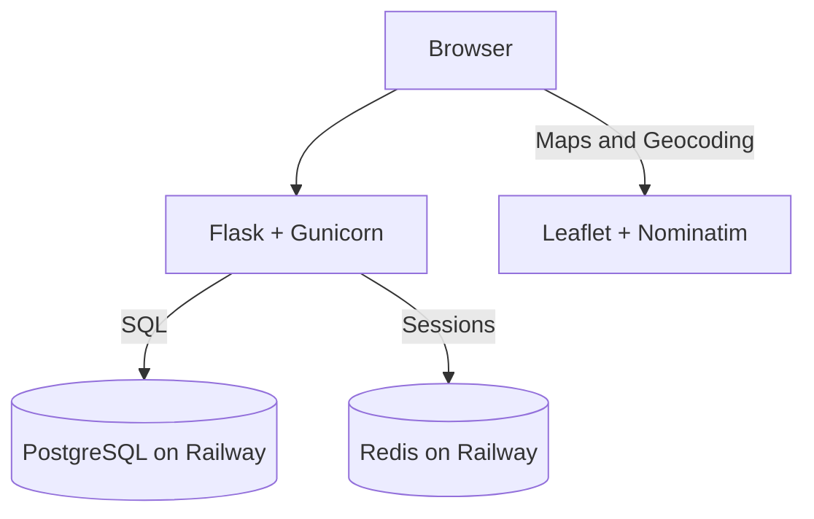
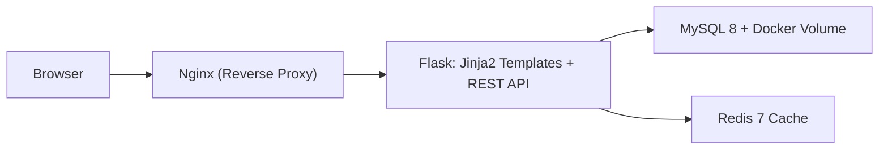
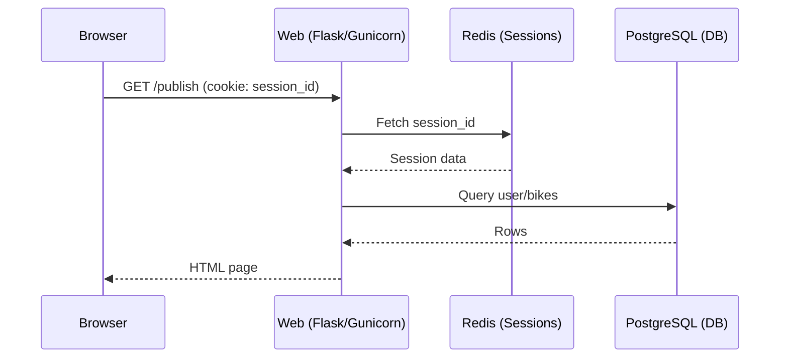
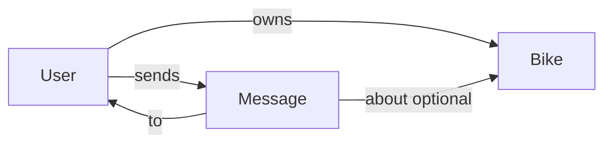

# Design Document

> Keep this document brief (2–4 pages), clear, and up-to-date throughout the project.
> You may use Mermaid diagrams for architecture visuals.

| Field          | Value (fill in)              |
| -------------- | ---------------------------- |
| Project Name   |19trymismabicicleta           |
| Team Members   |Ismael Jimenez|
| Repository URL |https://github.com/dat515-2025/Group-19|
| Version        | v0.3 (update as you iterate) |
| Last Updated   | 2025/10/29                   |

## How to use this template

- Replace all placeholders with your project-specific content.
- Keep explanations concise; link to code or docs when helpful.
- Update this document as the design evolves to match the final implementation.

---

## 1. Overview

Briefly describe the application and its purpose.

1: Problem statement: What problem are you solving?

The students need some way to move around; a bike is perfect for that.

2: Target users / personas: Who benefits from this?

Students from the university as well as bike selling companies trying to get known.
Also exchange students can benefit most from this, as they can buy for one year and sell when they finish.

3: Primary objectives: 3–5 bullet points.

3.1- Let students buy bikes online.

3.2- Let students sell bikes.

3.3- Let students rent bikes.

4: Non-goals: What is explicitly out of scope?

Built-in messaging interface: No real-time chat. We include simple user-to-user messaging (not real-time).

5: Key features: Short bullet list of core functionality.
- Main marketplace feed that shows all listings except your own (excludeMine by default), with search and filters.
- Any logged-in user can publish a bike (no separate buyer/seller profiles).
- Buy and Rent buttons on each listing to express intent and initiate contact (via messaging).
- Product location: store lat/lon and location name; show map on publish and detail pages; "Near me" filter.
- Messaging between users (simple, non-realtime).
- Authentication (login approves if password matches hash) and authorization (owner-only actions like delete/edit).

## 2. Architecture

High-level architecture, main components, interactions, and data flow. Include a system diagram.

### 2.1 System diagram
Final architecture

Architecture in local

Components and responsibilities:

Local (Docker Compose):
- **Browser:** User interface; makes HTTP requests to view pages and call APIs.
- **Nginx:** Reverse proxy listening on port 8080; forwards all traffic to Flask (port 5000); adds cache-control headers.
- **Flask (Python 3.9):** Web server serving HTML via Jinja2 templates and JSON REST API endpoints (`/api/*`). Handles sessions, business logic, and DB queries.
- **MySQL 8:** Relational database with `users` and `bikes` tables; data persisted via Docker volume `db_data`.
- **Redis 7:** In-memory cache for sessions and potential query results.

Production (Railway):
- **Browser:** User interface; makes HTTP requests to view pages and call APIs; renders Leaflet maps.
- **Flask (Python):** Web server (Gunicorn in prod) serving HTML via Jinja2 templates and JSON REST API endpoints (`/api/*`). Handles sessions (Flask-Session with Redis), business logic, and DB queries.
- **PostgreSQL (Railway):** Relational database with `users`, `bikes` and `messages` tables; bikes include `location_name`, `latitude`, `longitude`; users include `password_hash`.
- **Redis (Railway):** Session store. Sessions are stored server-side to enable stateful app with stateless web server processes.
- **Leaflet + Nominatim:** Client-side map rendering and geocoding (search place names, set coordinates when publishing).

Data flow example:
1. User visits `/` → Flask renders `index.html` (Jinja2) → sends HTML to browser.
2. Page JavaScript fetches `/api/bikes?type=venta` → Flask queries PostgreSQL → returns JSON → browser updates listing.
3. User logs in via `/api/login` → Flask validates password (hash), creates session in Redis → session cookie returned.
4. On publish/detail pages, the browser uses Leaflet + Nominatim for map interactions and optional place search.

Notes on layers (concise):

- App logic (Flask): Implements API endpoints, templates, and business rules; runs under Gunicorn in production.
- Database (PostgreSQL): Main state store for users, bikes, and messages; durable (managed by Railway).
- Session store (Redis): Server-side sessions for authentication; keeps web server processes stateless.

Why Gunicorn in production

- Flask includes a development server (Werkzeug) that is not meant for production.
- Gunicorn is a production-grade WSGI server: it manages multiple workers, timeouts, and safe restarts.
- Outcome: better stability and concurrency behind Railway’s edge/proxy.

Templating and structure (Jinja2 and Blueprints)

- Jinja2 is Flask’s templating engine: it renders server-side HTML with {{ variables }} and .

Stateful app vs stateless web server processes

- Web processes (Gunicorn/Flask) are stateless: they do not keep request state in memory across requests, which enables horizontal scaling.
- The application is stateful overall because state lives in external services: sessions in Redis and data in PostgreSQL.
- This separation allows user sessions (application state) without coupling them to a specific server process.

Geocoding

- Geocoding: convert place names/addresses into coordinates (latitude/longitude).
- Reverse geocoding: obtain a place name/address from coordinates.
- We use Nominatim (OpenStreetMap) from the client and Leaflet to show/select positions and enable "Near me".

Request flow (stateless web, external state)

- State management: Where is state stored (DB, cache, object store)?
  
Relational DB (PostgreSQL – Railway) – users, bikes and messages data.
Primary stateful component; stores users (with password hashes), bike listings (with location fields), and messages.
Sessions (Redis – Railway) – server-side session data for authenticated users.

- External dependencies: APIs, third-party services, webhooks.
  
Leaflet + Nominatim (geocoding). Railway managed services: PostgreSQL and Redis.

### 2.2 Data model (if applicable)

- Core entities and relationships (ER sketch or brief description).
- Example records or schemas (link to files or include concise snippets).

### 2.3 APIs (REST/gRPC/GraphQL)

- Interface style and rationale.

    We will implement a **RESTful API** using the **JSON** data format.
  REST is the standard architectural style for web services due to its simplicity, statelessness, and wide compatibility across all client types (browsers, mobile apps, etc.). It aligns naturally with our CRUD operations and HTTP methods.

  The API acts as the **contract** between the Presentation Layer and the Logic Layer.

**API Provider:** Flask implements all `/api/*` endpoints, processes business logic, and returns JSON.

**API Consumer:** Browser JavaScript (in Jinja2 templates) fetches API endpoints to dynamically update the UI.

Endpoints implemented (highlights):

| **Method** | **Endpoint**        | **Description**                             | **Status** |
| ---------- | ------------------- | ------------------------------------------- | ---------- |
| `GET`      | `/api/bikes`        | List bikes with filters (type, search, price ranges, excludeMine, near-me) | ✅ Implemented |
| `POST`     | `/api/bikes`        | Add a new bike (requires login; supports location_name/lat/lon)   | ✅ Implemented |
| `PUT`      | `/api/bikes/{id}`   | Update bike (ownership check; location fields)                    | ✅ Implemented |
| `DELETE`   | `/api/bikes/{id}`   | Remove bike (ownership check)                                      | ✅ Implemented |
| `GET`      | `/api/bikes/{id}`   | Get single bike details                                             | ✅ Implemented |
| `POST`     | `/api/login`        | Login with password (hash verified); session stored in Redis       | ✅ Implemented |
| `POST`     | `/api/logout`       | Clear session                                                       | ✅ Implemented |
| `GET`      | `/api/me`           | Get current user session                                            | ✅ Implemented |
| `GET`      | `/health`           | Service health (DB and Redis checks)                                | ✅ Implemented |
| `POST`     | `/api/transactions` | Create a purchase transaction               |  Planned |
| `POST`     | `/api/rentals`      | Register a rental                           |  Planned |
| `GET`      | `/api/users/{id}`   | Get user profile (API form)                 |  Planned |

Routing model: pages vs API

- Pages (server-rendered): routes like `/`, `/publish`, `/bikes/{id}`, `/about` return HTML rendered with Jinja2. The page route `/bikes/{id}` queries the database on the server and renders HTML; it doesn’t need to call the API.
- API (JSON): routes under `/api/*` return JSON for CRUD operations and actions from the front end. A matching API route `/api/bikes/{id}` returns the same data as JSON.
- Useful exception: `/health` is not under `/api` but returns JSON for health checks (DB/Redis) and monitoring.

## 3. Technologies

Current implementation stack.

| Technology / Service | Role / Where Used | Why chosen (brief) | Alternatives considered |
|----------------------|-------------------|--------------------|-------------------------|
| Python 3.11.5 | Backend language | Simple, good ecosystem for web | Node.js, Go |
| Flask | Backend web framework and REST API | Lightweight, quick to develop | Django, FastAPI |
| Jinja2 | HTML templating (server-side rendering) | Built-in with Flask | React, Vue (client-side) |
| Flask-Session | Server-side sessions | Integrates with Redis backend | Custom session stores |
| redis-py | Redis client for Python | Stable, widely used | -- |
| PostgreSQL (Railway) | Relational database | Managed service, reliable | MySQL |
| psycopg2-binary | Python PostgreSQL driver | Mature driver | asyncpg |
| Leaflet + Nominatim | Maps and geocoding (client) | Open-source, easy to integrate | Google Maps, Mapbox |
| Docker | Container runtime | Consistent environments | Podman |
| Railway | Managed deployment (web, Postgres, Redis) | Simple cloud hosting | Fly.io, Render |
| GitHub / Git | Version control | Standard tooling | GitLab, Bitbucket |

Notes:
- REST API using JSON data format for `/api/*` endpoints.
- Server-rendered HTML via Jinja2 templates for UI pages.
- Docker Compose for local dev; Kubernetes considered for future production deployment.

## 4. Deployment

Current production deployment (Railway).

**Environment:** Production (Railway: Web service + managed PostgreSQL + managed Redis).

**Runtime platform:** Gunicorn (Flask) behind Railway’s edge; no custom Nginx in prod.

**Configuration:**
- Environment variables: `DB_URL`, `REDIS_URL`, `SECRET_KEY`, `PORT`.
- Migrations: idempotent schema adjustments on startup (guarded via config if needed).

**Healthchecks:**
- `/health` checks DB connectivity and Redis ping; returns overall status.

**Local development (optional):**
- Docker Compose for local runs with Flask and Redis; database can be a local Postgres or the managed Railway DB (via URL).

---

## Optional Sections

Include the sections below as applicable to your project.

### Security

- Authn/Authz model; data protection; TLS/HTTPS; secrets handling; dependency scanning.

### Scalability

- Expected load; performance targets; bottlenecks; caching; rate limits.

### Monitoring & Logging

- Health checks; logs; metrics (e.g., Prometheus); dashboards; alerting.

### Disaster Recovery

- Backups; restore procedures; RPO/RTO targets; failure scenarios.

### Cost Analysis

- Main cost drivers; pricing model; cost-saving measures; budget estimate.

### References

- Links to papers, docs, blog posts, prior art, and any external resources.

---

## Change Log

- v0.1 – Initial draft
- v0.2 – Architecture updated to match implementation
- v0.3 – Architecture updated to match implementation (Railway, PostgreSQL, Redis, Leaflet)
- v1.0 – Final version reflecting delivered system
