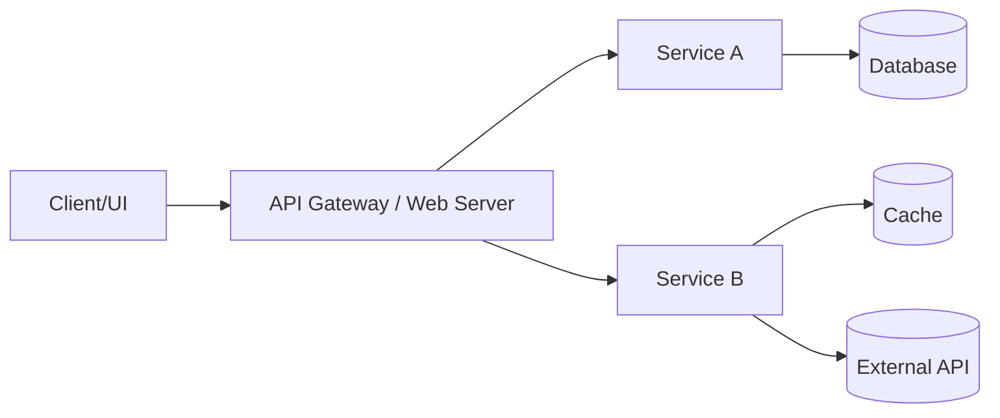
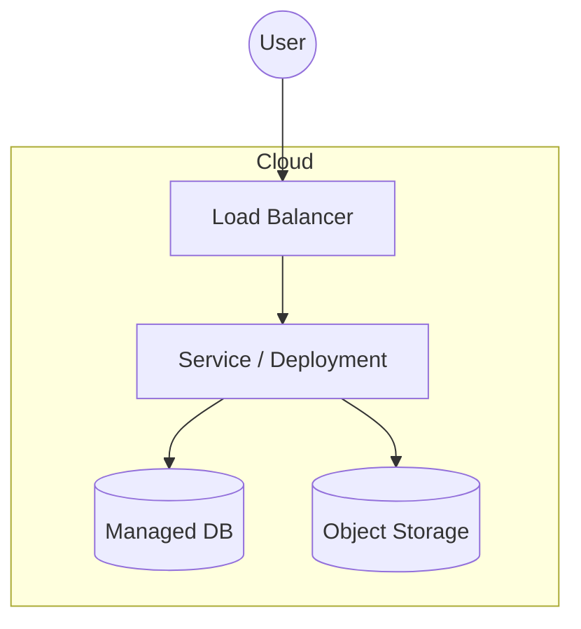

# Design Document

> Keep this document brief (2–4 pages), clear, and up-to-date throughout the project.
> You may use Mermaid diagrams for architecture visuals.

| Field          | Value (fill in)              |
| -------------- | ---------------------------- |
| Project Name   |19trymismabicicleta           |
| Team Members   |Trym Falkum and Ismael Jimenez|
| Repository URL |https://github.com/dat515-2025/Group-19|
| Version        | v0.1 (update as you iterate) |
| Last Updated   | 2025/10/07                   |

## How to use this template

- Replace all placeholders with your project-specific content.
- Keep explanations concise; link to code or docs when helpful.
- Update this document as the design evolves to match the final implementation.

---

## 1. Overview

Briefly describe the application and its purpose.

1: Problem statement: What problem are you solving?
The students need some way to move around, a bike is perfect for that.

2: Target users / personas: Who benefits from this?
Students from the university as well as bike selling companies trying to get known.
Also exchange students can benefit most from this, as they can buy for one year and sell when they finish.

3: Primary objectives: 3–5 bullet points.
3.1- Let's students buy bikes online.
3.2- Let's students sell bikes.
3.3- Let's students rent bikes.

4: Non-goals: What is explicitly out of scope?
Built-in messaging interface: The application will not include a real-time, in-app chat or full messaging system. While buyers and sellers will be able to contact each other (e.g., via email links, external messaging apps, or simple contact forms), implementing a dedicated messaging interface inside the web application (with message history, live notifications, typing indicators, etc.) is out of scope for this project.


5: Key features: Short bullet list of core functionality.
- List of all the selling bikes
- Buy button/rent button in each bike for students interested in buying/renting
- Sell button/rent out button in the bottom of page for students interested in selling filters 

## 2. Architecture

High-level architecture, main components, interactions, and data flow. Include a system diagram.

### 2.1 System diagram




```
flowchart LR
  User[Client/User] --> Service_FE(K8s Service: Frontend)
  Service_FE --> Deployment_FE[Deployment: Nginx/Frontend]
  Deployment_FE --> Service_API(K8s Service: API Backend)
  Service_API --> Deployment_API[Deployment: API Service (Flask/Node)]
  Deployment_API --> Service_DB(K8s Service: Database)
  Service_DB --> StatefulSet_DB[StatefulSet: PostgreSQL]
  StatefulSet_DB --> PV(Persistent Volume Claim)
```

- Components and responsibilities: What does each box do?
- Data flow: How does data move between components?
- State management: Where is state stored (DB, cache, object store)?
- External dependencies: APIs, third-party services, webhooks.

### 2.2 Data model (if applicable)

- Core entities and relationships (ER sketch or brief description).
- Example records or schemas (link to files or include concise snippets).

### 2.3 APIs (REST/gRPC/GraphQL)

- Interface style and rationale.
- Link to OpenAPI/Proto files, or list a few key endpoints/RPCs.

## 3. Technologies

List the cloud services, libraries, and tools you will use and why.

| Technology / Service | Role / Where Used | Why chosen (brief) | Alternatives considered |
| -------------------- | ----------------- | ------------------ | ----------------------- |
|                      |                   |                    |                         |

Notes:

- Languages & frameworks (e.g., Go, Node, Python; Gin, Fiber, Echo).
- Cloud provider and managed services (compute, DB, storage, messaging).
- CI/CD, IaC, containerization.

## 4. Deployment

Describe the deployment strategy and infrastructure requirements.

- Environments: dev / staging / prod (if applicable).
- Runtime platform: Docker, Compose, Kubernetes, serverless, PaaS.
- Infrastructure diagram (optional):



- Configuration & secrets: Env vars, secret manager, .env files (never commit secrets).
- Build & release: How artifacts are built; link to CI/CD if used.
- Deployment steps: Summarize here; full, reproducible steps must be in report.md.
- Scaling strategy: Horizontal/vertical scaling, autoscaling triggers.

---

## Optional Sections

Include the sections below as applicable to your project.

### Security

- Authn/Authz model; data protection; TLS/HTTPS; secrets handling; dependency scanning.

### Scalability

- Expected load; performance targets; bottlenecks; caching; rate limits.

### Monitoring & Logging

- Health checks; logs; metrics (e.g., Prometheus); dashboards; alerting.

### Disaster Recovery

- Backups; restore procedures; RPO/RTO targets; failure scenarios.

### Cost Analysis

- Main cost drivers; pricing model; cost-saving measures; budget estimate.

### References

- Links to papers, docs, blog posts, prior art, and any external resources.

---

## Change Log

- v0.1 – Initial draft
- v0.2 – Architecture updated to match implementation
- v1.0 – Final version reflecting delivered system
