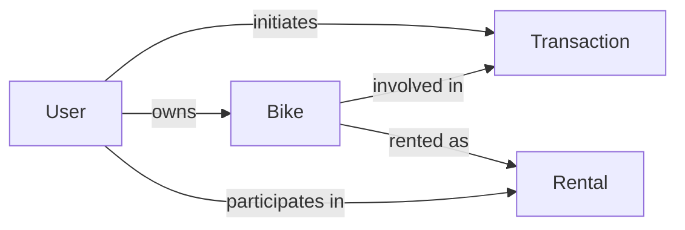

# Design Document

> Keep this document brief (2–4 pages), clear, and up-to-date throughout the project.
> You may use Mermaid diagrams for architecture visuals.

| Field          | Value (fill in)              |
| -------------- | ---------------------------- |
| Project Name   |19trymismabicicleta           |
| Team Members   |Ismael Jimenez|
| Repository URL |https://github.com/dat515-2025/Group-19|
| Version        | v0.1 (update as you iterate) |
| Last Updated   | 2025/10/22                   |

## How to use this template

- Replace all placeholders with your project-specific content.
- Keep explanations concise; link to code or docs when helpful.
- Update this document as the design evolves to match the final implementation.

---

## 1. Overview

Briefly describe the application and its purpose.

1: Problem statement: What problem are you solving?

The students need some way to move around, a bike is perfect for that.

2: Target users / personas: Who benefits from this?

Students from the university as well as bike selling companies trying to get known.
Also exchange students can benefit most from this, as they can buy for one year and sell when they finish.

3: Primary objectives: 3–5 bullet points.

3.1- Let's students buy bikes online.

3.2- Let's students sell bikes.

3.3- Let's students rent bikes.

4: Non-goals: What is explicitly out of scope?

Built-in messaging interface: The application will not include a real-time, in-app chat or full messaging system.

It also is out of scope to do the authentification for the client. It can be the buyer or the seller, but it will just select it from the page it requests it.

5: Key features: Short bullet list of core functionality.
- List of all the selling bikes
- Buy button/rent button in each bike for students interested in buying/renting
- Sell button/rent out button in the bottom of page for students interested in selling filters 
- Filtering and searching (for bikes as well as for users)

## 2. Architecture

High-level architecture, main components, interactions, and data flow. Include a system diagram.

### 2.1 System diagram

```mermaid
flowchart LR
  Client[Browser] --> Nginx[Nginx (Reverse Proxy)]
  Nginx --> Flask[Flask: Jinja2 Templates + REST API]
  Flask --> MySQL[(MySQL 8 + Docker Volume)]
  Flask --> Redis[(Redis 7 Cache)]
```

Components and responsibilities:

- **Browser:** User interface; makes HTTP requests to view pages and call APIs.
- **Nginx:** Reverse proxy listening on port 8080; forwards all traffic to Flask (port 5000); adds cache-control headers.
- **Flask (Python 3.9):** Web server serving HTML via Jinja2 templates and JSON REST API endpoints (`/api/*`). Handles sessions, business logic (e.g., rental calculation), and DB queries.
- **MySQL 8:** Relational database with `users` and `bikes` tables; data persisted via Docker volume `db_data`.
- **Redis 7:** In-memory cache for sessions and potential query results.

Data flow example:
1. User visits `/` → Nginx forwards → Flask renders `index.html` (Jinja2) → sends HTML to browser.
2. Page JavaScript fetches `/api/bikes?type=venta` → Nginx → Flask queries MySQL → returns JSON → browser updates listing.
3. User logs in via `/api/login` → Flask creates session (stored in-memory or Redis) → session cookie returned.

2nd Layer: Logic


Backend API Deployment (Flask/Node): This single component is the core of the application logic. It encapsulates both the HTTP Server (Runner/Host), which manages persistent network connections and container uptime, and the Application Framework that implements all API endpoints, executes the business logic (like calculating rental costs), and coordinates all read/write operations with the PostgreSQL database. Both roles are contained within a single Pod for efficient request processing.


3rd Layer: Database

 Database Service: The Internal Address Book (Kubernetes Service). Provides a stable internal hostname (e.g., postgres-service) for the API to connect to the database. The API only talks to this service, not directly to the database Pod, so the database can scale without having notice of it.

 Database Server: The Data Manager. Current: MySQL 8 (Docker volume). Target: PostgreSQL (PVC/PV in K8s).

 Persistence Block: The Virtual Hard Drive. This combination ensures data durability. The PersistentVolumeClaim (PVC) requests disk space, which K8s fulfills using a PersistentVolume (PV)

- Data flow: How does data move between components?
  
Student / Client → Web Gateway

The User send requests to the web gateway (for example: viewing bikes)

Gateway → Frontend (for UI) or → Backend API

Routes incoming requests either to the frontend deployment or to the backend API. Handles network exposure, load balancing, and ingress routing. Routes incoming requests. For example the browser sends an initial HTTP request (usually GET /) to retrieve the main web page. The Service receives the incoming request. Since the request path is just / (the root of the site, which is static content), the Service routes the request to the Frontend Deployment's Pods. But in the example we're looking to show all the bikes, so it sends the petition to backend.

Backend → Database Service → PostgreSQL

When the viewbikes requests get here this web server will handle and call the registered endpoint in the framework, which will call the database looking for the bikes.

PostgreSQL → Backend → Client

The framework will call this database and send all the bikes to the backend and then back to the cliente with the loaded page.


- State management: Where is state stored (DB, cache, object store)?
  
Relational DB (current: MySQL; target: PostgreSQL) – user, bike, and transaction data
Acts as the main stateful component in the system.
Stores all structured and relational data, including users, bike listings, rental contracts, and transaction history.
Supports ACID transactions, ensuring data consistency across buy/sell/rent operations.
Data is persisted even if backend pods are recreated, as it is tied to the underlying PersistentVolume.
PVC/PV – persistent disk for database
Handles the physical state management of stored data.
The PersistentVolumeClaim (PVC) requests storage resources, while the PersistentVolume (PV) provides the actual disk (local or cloud-based).
Ensures that PostgreSQL retains data through pod restarts, scaling events, or node failures.
Provides durability and separation between compute (the PostgreSQL pod) and storage (the PV), allowing flexible recovery and migration.

- External dependencies: APIs, third-party services, webhooks.
  
Not for now.


### 2.2 Data model (if applicable)

- Core entities and relationships (ER sketch or brief description).
- Example records or schemas (link to files or include concise snippets).




### 2.3 APIs (REST/gRPC/GraphQL)

- Interface style and rationale.

    We will implement a **RESTful API** using the **JSON** data format.
  REST is the standard architectural style for web services due to its simplicity, statelessness, and wide compatibility across all client types (browsers, mobile apps, etc.). It aligns naturally with our CRUD operations and HTTP methods.

  The API acts as the **contract** between the Presentation Layer and the Logic Layer.

**API Provider:** Flask implements all `/api/*` endpoints, processes business logic, and returns JSON.

**API Consumer:** Browser JavaScript (in Jinja2 templates) fetches API endpoints to dynamically update the UI.

Endpoints implemented:

| **Method** | **Endpoint**        | **Description**                             | **Status** |
| ---------- | ------------------- | ------------------------------------------- | ---------- |
| `GET`      | `/api/bikes`        | List bikes with filters (type, search, price ranges, excludeMine) | ✅ Implemented |
| `POST`     | `/api/bikes`        | Add a new bike (requires login)             |  Implemented |
| `PUT`      | `/api/bikes/{id}`   | Update bike (ownership check)               |  Implemented |
| `DELETE`   | `/api/bikes/{id}`   | Remove bike (ownership check)               |  Implemented |
| `POST`     | `/api/login`        | Simple login (name only)                    |  Implemented |
| `POST`     | `/api/logout`       | Clear session                               |  Implemented |
| `GET`      | `/api/me`           | Get current user session                    |  Implemented |
| `GET`      | `/api/bikes/{id}`   | Get single bike details                     |  Planned |
| `POST`     | `/api/transactions` | Create a purchase transaction               |  Planned |
| `POST`     | `/api/rentals`      | Register a rental                           |  Planned |
| `GET`      | `/api/users/{id}`   | Get user profile (API form)                 |  Planned |


## 3. Technologies

Current implementation stack.

| Technology / Service | Role / Where Used | Why chosen (brief) | Alternatives considered |
|----------------------|-------------------|--------------------|-------------------------|
| Python 3.9 | Backend language | Simple, good ecosystem for web | Node.js, Go |
| Flask | Backend web framework and REST API | Lightweight, quick to develop | Django, FastAPI |
| Jinja2 | HTML templating (server-side rendering) | Built-in with Flask | React, Vue (client-side) |
| Nginx (Alpine) | Reverse proxy to Flask | Industry standard, lightweight | Apache, Caddy |
| MySQL 8 | Relational database (persistent volume) | Familiar, stable | PostgreSQL |
| mysql-connector-python | Python MySQL driver | Official driver | PyMySQL, SQLAlchemy ORM |
| Redis 7 (Alpine) | Cache and session support | Fast in-memory store | Memcached |
| Docker | Container runtime | Consistent environments | Podman |
| Docker Compose | Local orchestration | One-file dev setup | Kubernetes (future) |
| GitHub / Git | Version control | Standard tooling | GitLab, Bitbucket |

Notes:
- REST API using JSON data format for `/api/*` endpoints.
- Server-rendered HTML via Jinja2 templates for UI pages.
- Docker Compose for local dev; Kubernetes considered for future production deployment.

## 4. Deployment

Current deployment setup (development).

**Environment:** Development (local machine).

**Runtime platform:** Docker Compose orchestrating 4 services:
- `nginx` (Nginx Alpine): Reverse proxy on host port 8080.
- `app` (Flask): Backend built from `backend/Dockerfile` (Python 3.9-slim).
- `database` (MySQL 8): Relational DB with healthcheck and init script (`database/init.sql`).
- `cache` (Redis 7 Alpine): In-memory cache with append-only persistence.

**Configuration:**
- Environment variables in `docker-compose.yaml` (DB_HOST, DB_USER, DB_PASSWORD, REDIS_HOST).
- Secrets: hardcoded for dev; in production should use Docker secrets or secret manager.
- Nginx config: `nginx.conf` mounted read-only; adds no-cache headers.

**Build & run:**
```bash
docker compose up -d --build
docker compose ps  # verify all services healthy
```

**Healthchecks:**
- MySQL: `mysqladmin ping` every 15s.
- Redis: `redis-cli ping` every 5s.
- Flask: HTTP GET to `/health` every 10s.

**Volumes:**
- `db_data`: MySQL persistent storage.
- `cache_data`: Redis append-only file.

**Scaling (current):** Single instance of each service; suitable for development and small-scale testing.

**Future considerations:** Kubernetes deployment with Ingress, StatefulSet for DB, horizontal pod autoscaling for Flask.

---

## Optional Sections

Include the sections below as applicable to your project.

### Security

- Authn/Authz model; data protection; TLS/HTTPS; secrets handling; dependency scanning.

### Scalability

- Expected load; performance targets; bottlenecks; caching; rate limits.

### Monitoring & Logging

- Health checks; logs; metrics (e.g., Prometheus); dashboards; alerting.

### Disaster Recovery

- Backups; restore procedures; RPO/RTO targets; failure scenarios.

### Cost Analysis

- Main cost drivers; pricing model; cost-saving measures; budget estimate.

### References

- Links to papers, docs, blog posts, prior art, and any external resources.

---

## Change Log

- v0.1 – Initial draft
- v0.2 – Architecture updated to match implementation
- v1.0 – Final version reflecting delivered system
